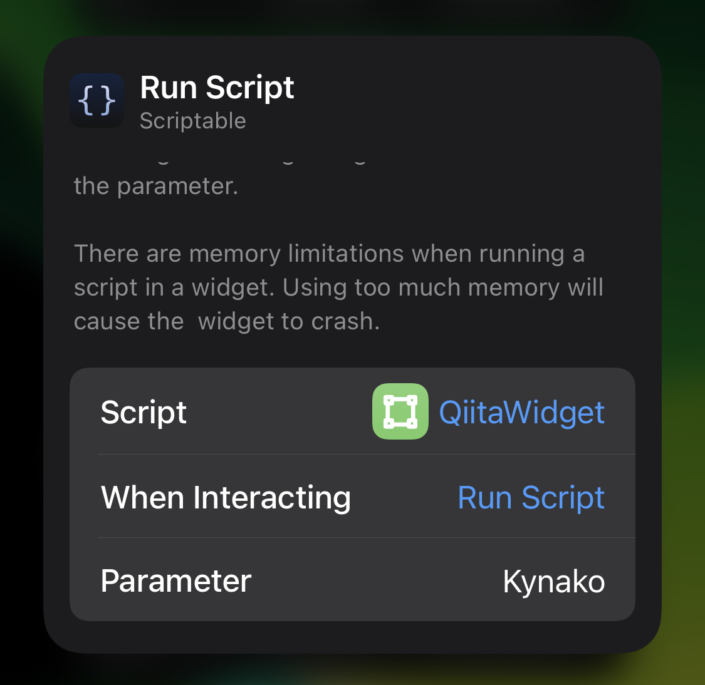

**INPORTANT** This repository is moving to [Scriptable](https://github.com/Kynako/Scriptable)
# QiitaWidget
A widget to show Qiita user data.

|version|status|
|-----|-----|
|v1|usable|
|v2|In development|

## Overview

## Requirement
- iOS14.4
- iPhoneXS
- [Scriptable](https://scriptable.app/) v1.6.3
- [Qiita](https://qiita.com/) Personal Token

## Usage
1. Copy [QiitaWidget:INIT.js](https://github.com/Kynako/QiitaWidget/blob/main/QiitaWidget:INIT.js) into your `iCloud/Scriptable/` folder and run it.
2. Input your Qiita personal token to the text field.
3. Set a Scriptable widget to homescreen and modify parameter like the image.

|Name|Value|
|-----|-----|
|Script|`QiitaWidget`|
|When interacting|something|
|Parameter|*userid*|

## License
[MIT license](https://github.com/Kynako/QiitaWidget/blob/main/LICENSE)

[cache.js](https://github.com/evandcoleman/scriptable/blob/main/LICENSE)

[getWidgetSizeInPoint](https://talk.automators.fm/t/get-available-widget-height-and-width-depending-on-the-devices-screensize/9258/5)
